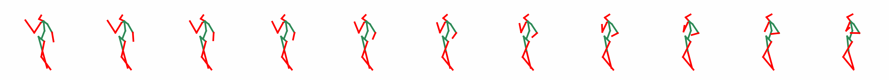
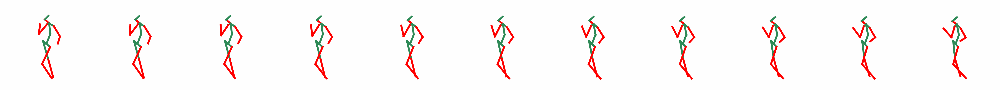
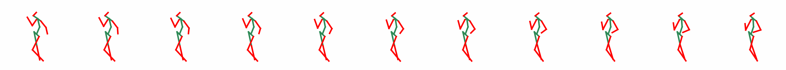
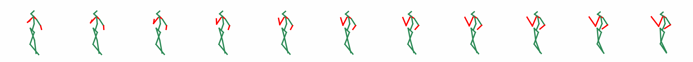
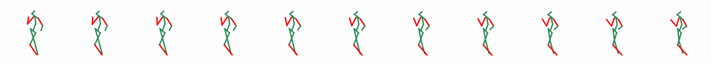
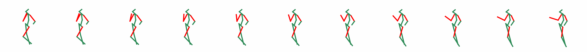
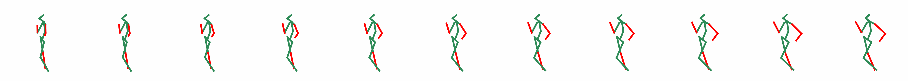
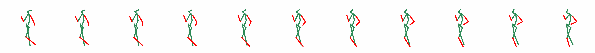
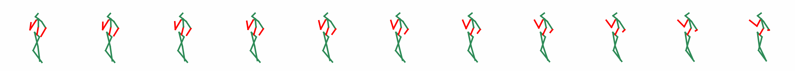

# Reply to Reviewer WmS2
## Interpretability Results

Red: Changing Joints

Green: Stable Joints

### Interpolation visualizations of High-Level Latent Variables

Left arm bending degree, left arm length, leg bending degree  
  

Standing posture, position of both hands, angle of both arms  
  

Degree of bending in both legs, degree of bending in both arms  
  

### Interpolation Visualizations of Low-Level Latent Variables

Length of both arms  
  

Placement angles of the left hand and right foot  
  

Angle of the left forearm and right foot  
  

Amplitude of both arms swinging  
  

Forward swing range of the left leg  
  

Angle of the right forearm  
